# **Data Dashboard** <h1>

***
***
## Sobre el producto <h2>

### GH PAGE
https://biokah.github.io/Laboratoria-dashboard/


### Usuario y contraseña
amalia@laboratoria.la

En **[Laboratoria](https://http://talento.laboratoria.la//)**, las _Training Managers (TMs)_ analizan datos respecto al desempeño de las estudiantes para dar un seguimiento a su aprendizaje. <br>
Para revisar esta data, las _TMs_, normalmente, tienen que chequear muchos documentos de excel _(Google Spreadsheets)_ que están localizados en distintas carpetas y ubicaciones, provocando que pierdan tiempo al consultar estos documentos.

Para poder optimizar su tiempo, las _TMs_ nos han puesto como reto  construir un _Data Dashboard_ que facilite su interacción con los datos y documentos.

Para ello, al realizarlo debemos tener en cuenta lo siguiente:

* El total de estudiantes presentes por sede y generación.
* El porcentaje de deserción de estudiantes.
* La cantidad de estudiantes que superan la meta de puntos en promedio de todos los _sprints_ cursados. La meta de puntos es 70% del total de puntos en _HSE_ y en _tech_.
* El porcentaje que representa el dato anterior en relación al total de estudiantes.
* El _Net Promoter Score (NPS)_ promedio de los sprints cursados. Éste se calcula en base a la encuesta que las estudiantes responden al respecto de la recomendación que darían de **Laboratoria**, bajo la siguiente fórmula:

```
 [Promoters] = [Respuestas 9 o 10] / [Total respuestas] * 100
[Passive] = [Respuestas 7 u 8] / [Total respuestas] * 100
[Detractors] = [Respuestas entre 1 y 6] / [Total respuestas] * 100
[NPS] = [Promoters] - [Detractors]
```

* La cantidad y el porcentaje que representa el total de estudiantes que superan la meta de puntos técnicos en promedio y por _sprint_.
* La cantidad y el porcentaje que representa el total de estudiantes que superan la meta de puntos de _HSE_ en promedio y por _sprint_.
* El porcentaje de estudiantes satisfechas con la experiencia de Laboratoria.
* La puntuación promedio de l@s profesores.
* La puntuación promedio de l@s jedi masters.
* Con esa información y con la base de datos que nos facilitaron pudimos crear este diseño. Sin embargo, creemos que tú podrías proponer algún cambio a este diseño que pueda mejorar la experiencia de las _TMs_.

## Requerimientos <h2>

* Trabajar en parejas
* Tener una planificación
* Definir del diseño
* Implementar el _Data Dashboard_ usando _html, css y js_
* Desplegar el producto en _**Github Pages**_

## ¿Cómo empezar? <h2>

1. Debes realizar un _[fork](https://gist.github.com/ivandevp/1de47ae69a5e139a6622d78c882e1f74)_ de este [repositorio](https://github.com/Laboratoria-learning/data-dashboard).

2. Luego deberás **clonar** tu fork en tu máquina. Recuerda que el comando a usar es git clone y su estructura normalmente se ve así:

```
git clone https://github.com/<nombre-de-usuario>/data-dashboard.git
```

## Adicionales <h2>

En **Laboratoria** somos adictos a la representación gráfica de los datos y como muestra el diseño, sería ideal poder mostrar los datos procesados en un gráfico como el diseño propone u otra alternativa.

>Nota: En la etapa de diseño de la experiencia del producto, nos dimos cuenta que _Google Charts_ podría ser una opción para desarrollar estos gráficos, pero no es la única que se puede usar .

Además, la proactividad de las _TMs_ hace que el siguiente requerimiento adicional sea muy útil:

>Tener un botón que permita indicar que una estudiante ha salido del _Bootcamp_ y alterar los totales afectados por este cambio.

***

## **Flujo de trabajo** <h2>

A cada pareja se le asignó un cliente "ficticio", en nuestro caso fue Amalia. <br>
Comenzamos a planificar a través de un cronograma.

 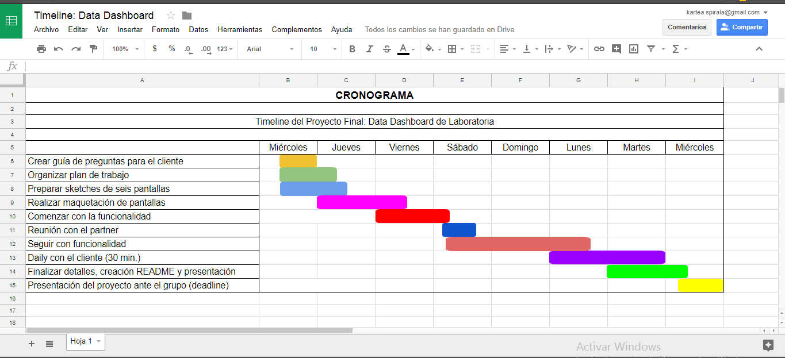

Las tareas fueron divididas tomando en cuenta las fortalezas de cada miembro de la dupla.

Se crearon canales de comunicación en _**Slack, Messenger, WhatsApp, Google Drive, Trello**_ para mantenernos al tanto, apoyarnos, no perder la ruta del proyecto; estar en cntacto con nuestro cliente, preguntar sus necesidades y que resuelva algunas dudas con respecto a su producto.


Se hicieron algunos _sketches_ para guiarnos y con ello nos dimos cuenta que era importante crear 6 plantillas: **Log in, Data Aula, Alumnas, Profersores, Perfil alumnas, Notas por sprint y Feedback**

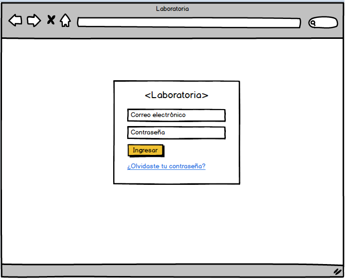

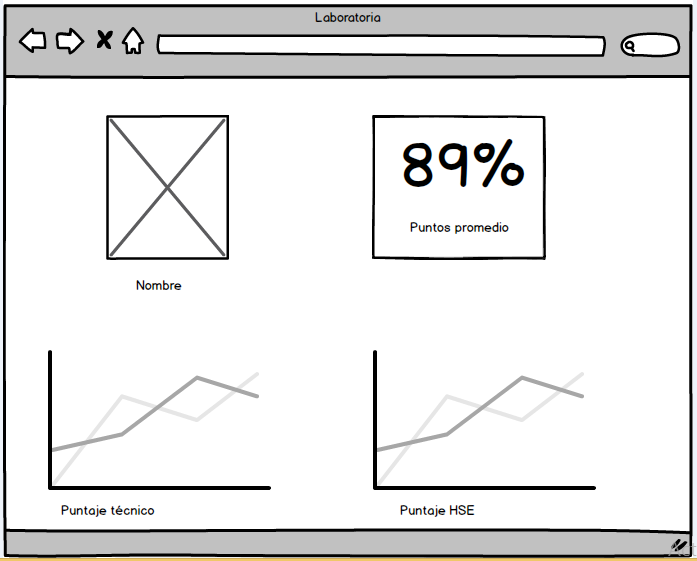

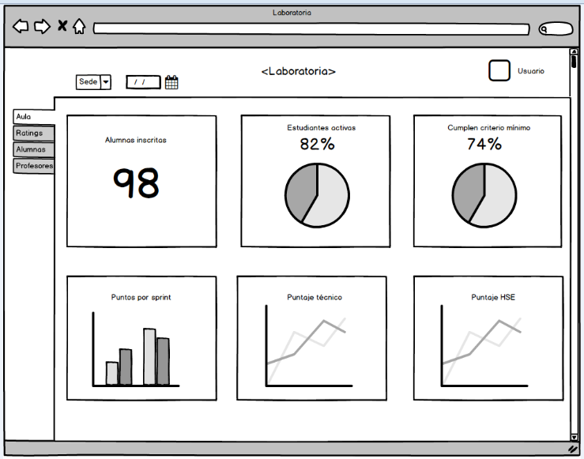

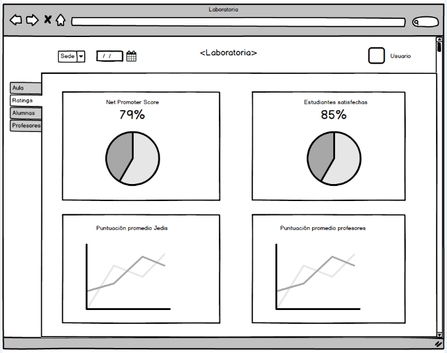

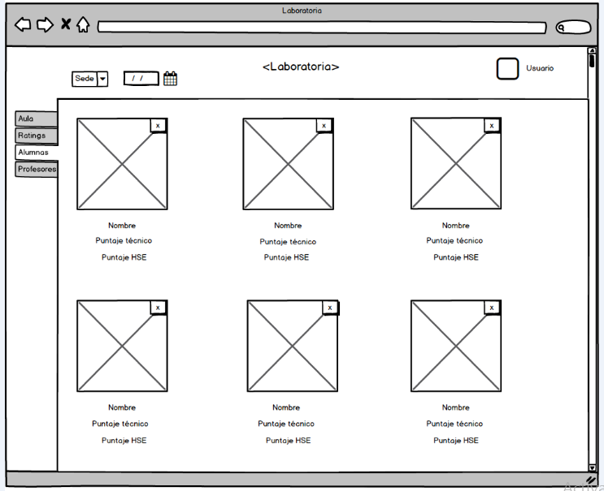


Al finalizar los _sketches_, se dio paso al maquetado en _html_ y _css_, dando como resultado:

> NOTA: El maquetado no se hizo responsivo, por lo que en algunas pantallas puede deformarse el diseño. Se maquetó en una pantalla de 13.3 pulgadas y resolución de 1280 x 800

Esta imagen corresponde al Log in, como correo y contraseña se utilizó:  __amalia@laboratoria.la__, la cuenta sí verifica y valida al correo y contraseña y si son incorrectos, manda un _alert_

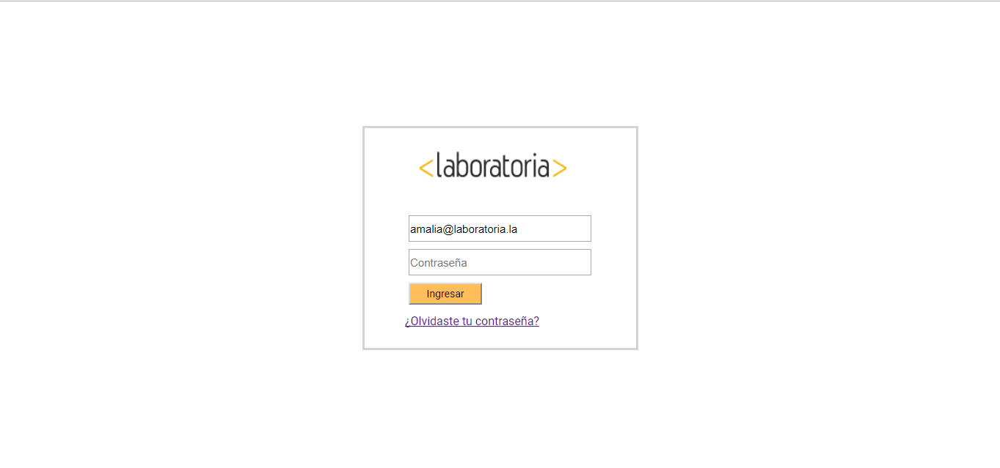

Se creó un _Select_ que guarda la información por sede, año y generación.

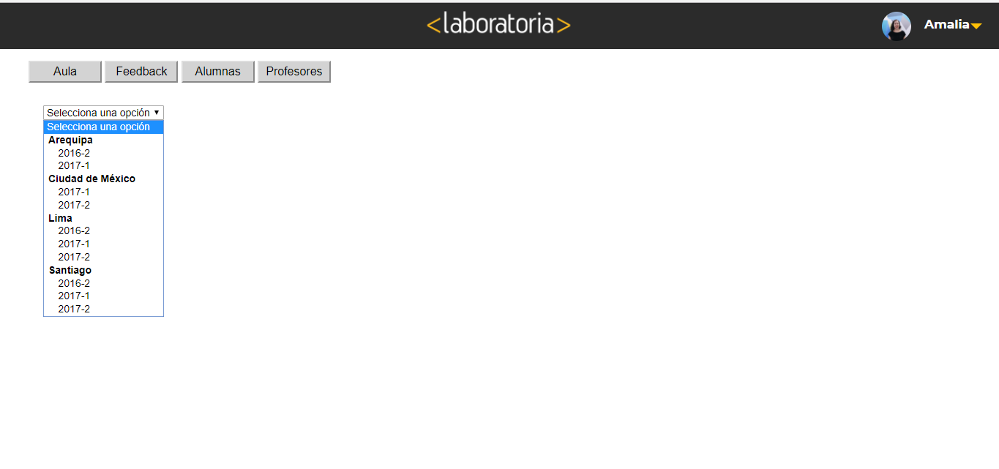

En el menú se muestra **Aula** que contiene las gráficas de las alumnas activas e inactivas, porcentaje de cuantas cumplieron la meta. Todo lo que se muestra es con datos reales, es decir, que al cambiar la sede, año y generación, el resultado de las gráficas será completamente diferente.

En la parte superior de las gráficas hay una barra con información de la sede, año y generación en la que el usuario esta navegando, ésto, con el fin que el mismo usuario pueda identificar en dónde se encuentra.

Otra aporte a la navegación entre los **botones** que contienen **Aula, Feedback, Alumnas y Profesores** se puede distinguir el cambio de color entre ellos, cuando el usuario le ha dado click.

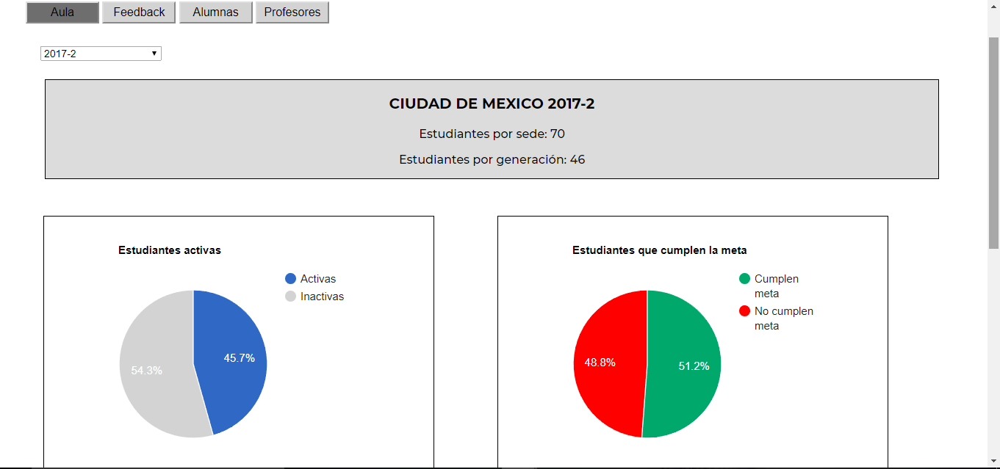

En el **botón Feedback** se localizan las gráficas con la informaión del _Net Promote Score_, porcentaje de alumnas satisfechas; al igual que en el **botón Alumnas** toda la información es real y con ello las gráficas cambian dependiendo de la selección.

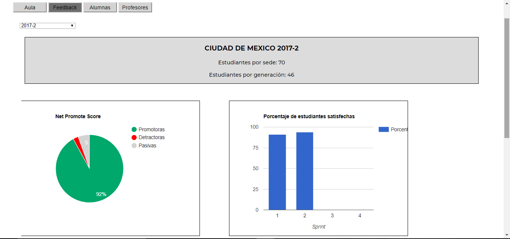

En esta sección el **botón Alumnas** muestra a las mismas, su nombre, su fotografía, si están activas o inactivas, su puntuación y en la parte superior hay una barra de búsqueda que es totalmente funcional.

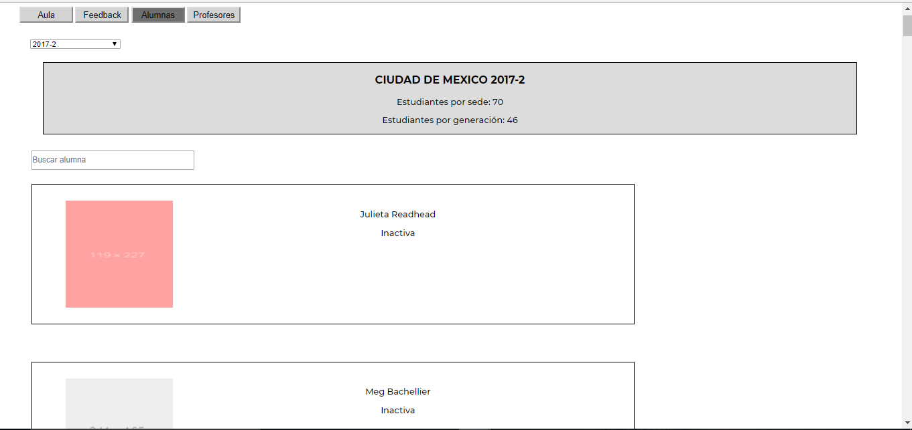

Al seleccionar a cualquiera de las alumnas, navegas a otra pantalla (en la imagen de abajo se muestra) dónde el usuario encuentra el perfil de la alumna de una manera más desglosada. Contiene su fotografía, gráficas que muestra su promedio y un menú que tiene la opción **Más información**

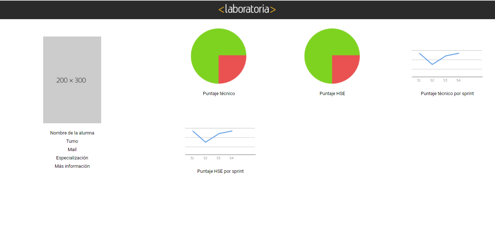

Al darle click a **Más información** nos manda a una pantalla dónde la información de evaluación del sprint es más específica y se puede elegir por sprint. Y al hacer click sobre el _header_ donde esta el logo **Laboratoria** nos regresa a la pantalla principal.

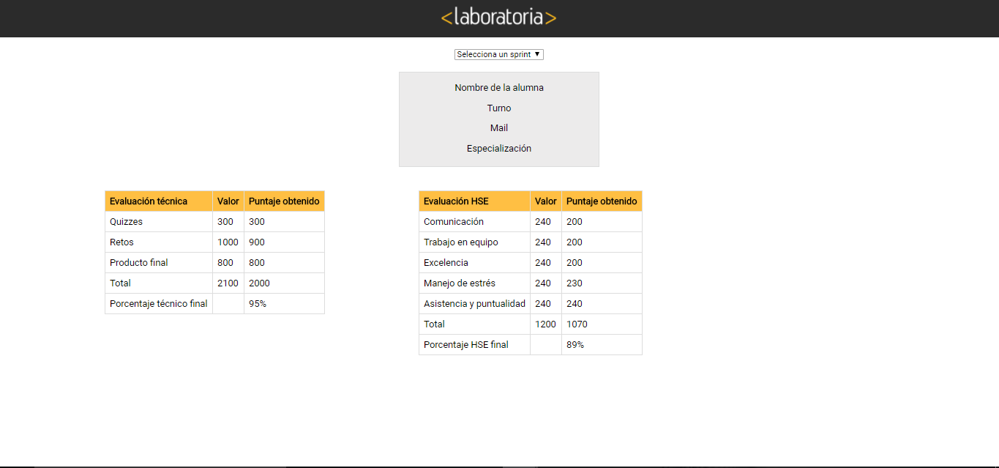

De regreso en la pantalla principal, en el **botón Profesores** nos despliega sus fotografías, nombre del profesor y su punmtaje - promedio de todos los _sprints_

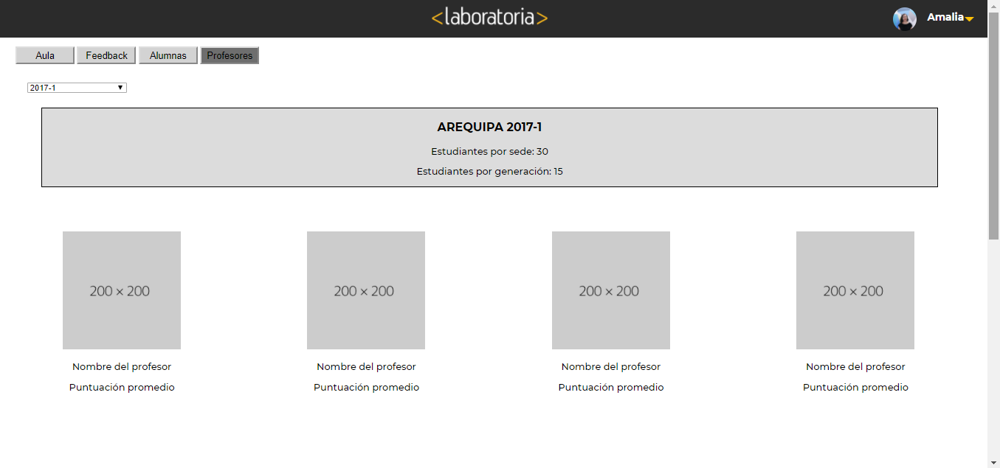


En este [video]() se muestra la interacción del usuario con el producto.

También se realizó un prototpo de la cuenta del usuario (perfil) que tienen herramientas como un calendario, agendar citas con otros profesores, checar correo, notificacines, etcétera.

 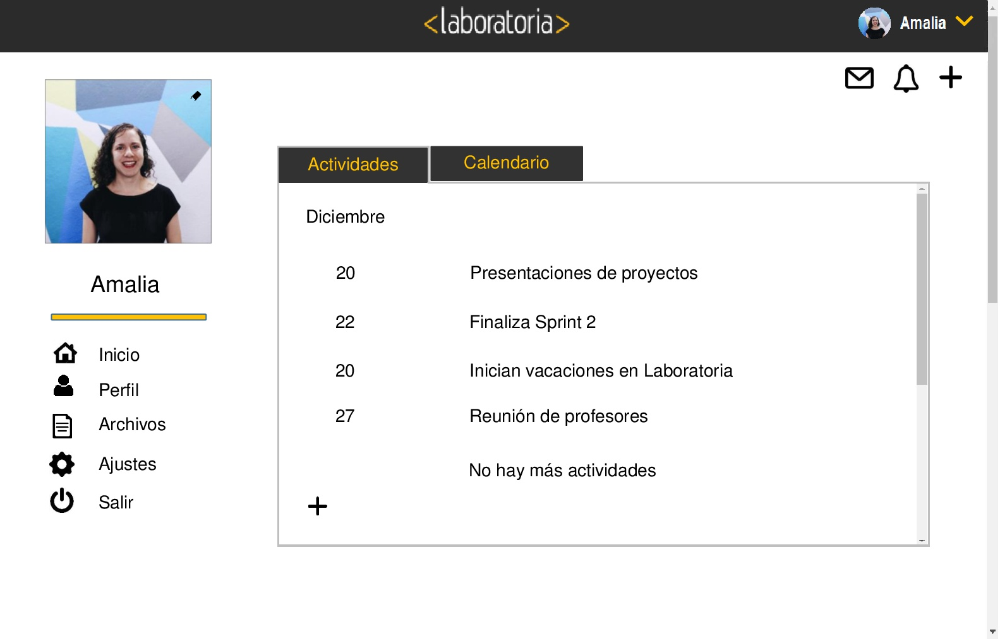

### Sobre JavaScript <h3>

Lo más destacable del desarrollo en Javascript fue la utilización de eventos, manipulación de elementos de HTML a través del DOM y manipulación de la data proporcionada a través del archivo Json.
La detonación del evento Change del select permitió establecer como variable nuestra opción elegida por el usuario, en este caso las diferentes sedes y generaciones. A partir de esto se accedió a la data en sus diferentes niveles, pues tuvo que trabajarse en arreglos de doble dimensión y objetos compuestos. También se implementaron validaciones que permitieran al usuario tener una mejor interacción con la plataforma. 
Para las gráficas se utilizó Google Charts con los datos obtenidos a través de la manipulación. 
